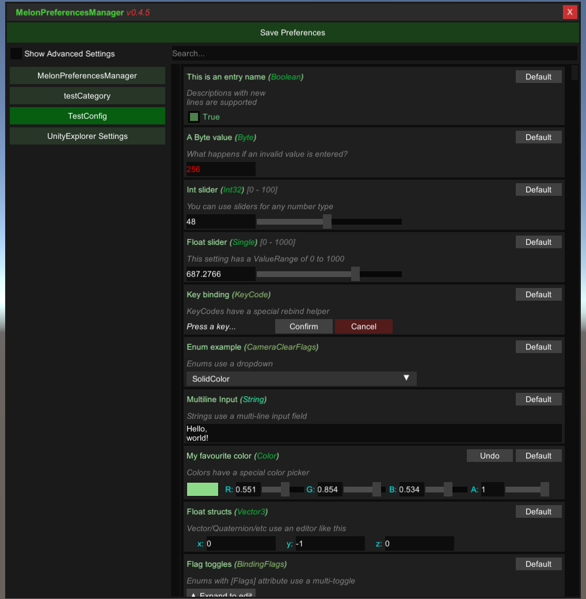

# MelonPreferencesManager

In-game UI for managing MelonLoader Mod Preferences. Supports IL2CPP and Mono Unity games.

Requires MelonLoader v0.3.1.

## Releases

* [Download (IL2CPP)](https://github.com/sinai-dev/MelonPreferencesManager/releases/latest/download/MelonPrefManager.IL2CPP.zip)
* [Download (Mono)](https://github.com/sinai-dev/MelonPreferencesManager/releases/latest/download/MelonPrefManager.Mono.zip)

## How to use

* Put the DLL in your `[GameFolder]\Mods\` folder.
* Start the game and press `F5` to open the Menu.
* You can change the keybinding under the `MelonPreferencesManager` category in the Menu, or by editing the file `[GameFolder]\UserData\MelonPreferences.cfg`.

## Info for developers

The UI supports the following types by default:

* Toggle: `bool`
* Number input: `int`, `float` etc (any primitive number type)
* String input: `string`
* Dropdown: `enum`
* Multi-toggle: `enum` with `[Flags]` attribute
* Color picker: `Color`
* Struct editor: `Vector2`, `Vector3`, `Vector4`, `Quaternion`, etc
* Toml input: Anything with a corresponding Mapper registered to `MelonPreferences.Mapper`.

To make a slider, use a number type and provide a `ValueRange` for the Validator when creating the entry.

You can register a custom UI handler for a Type, to override the default Toml input editor for it.
* Define a `MyIValueType : InteractiveValue` class (refer to existing classes for examples), and override methods/properties as necessary.
* In your MelonMod.OnApplicationStart method, call `InteractiveValue.RegisterIValueType<MyIValueType>();`
* Note: If the Type is already handled by an existing InteractiveValue, your one will not be used.

